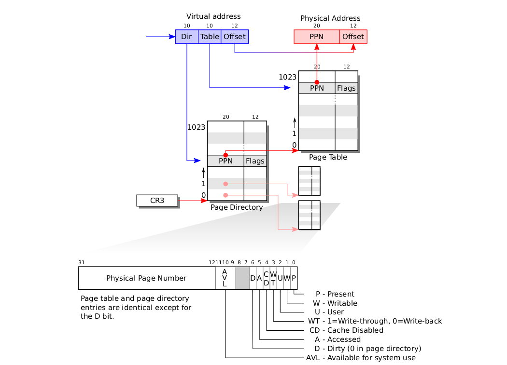
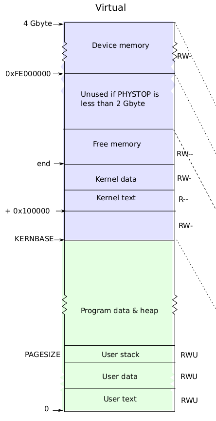

<h1 align="center">Memory Management</h1>

##  :beginner: Overview
* This section is an attempt to understanding **Memory Management** in **Xv6**.
* We will be implementing **lazy allocation** of heap memory, as most operating systems do, in **Xv6**.
* We will also implement the mechanism required for **swapping in** and **swapping out** of pages, an important feature lacking **Xv6**.
##  :round_pushpin: Basic Understanding of Memory Management in Xv6
* **Sbrk** is the system call for a process to shrink or grow its memory.
*  The **sbrk(n)** system call grows the process's memory size by **n** bytes, and then returns the start of the newly allocated region (i.e., the old size).
```C
int sys_sbrk(void)
{
  int addr;
  int n;

  if (argint(0, &n) < 0)
    return -1;
  addr = myproc()->sz;
  if (growproc(n) < 0)
    return -1;
  return addr;
}
```
* If n is postive, growproc(n) allocates one or more physical pages and maps them at the top of the process’s address space.
* If n is negative, growproc(n) unmaps one or more pages from the process’s address space and frees the corresponding physical pages.
```C
int
growproc(int n)
{
  uint sz;
  struct proc *curproc = myproc();

  sz = curproc->sz;
  if(n > 0){
    if((sz = allocuvm(curproc->pgdir, sz, sz + n)) == 0)
      return -1;
  } else if(n < 0){
    if((sz = deallocuvm(curproc->pgdir, sz, sz + n)) == 0)
      return -1;
  }
  curproc->sz = sz;
  switchuvm(curproc);
  return 0;
}
```
* The growproc() function in turn calls the allocuvm/deallocuvm functions which allocate/deallocate pages and updates the page table of the process.
* The kernel maintains a list of free pages with the help of **freelist**
```C
struct run {
  struct run *next;
};

struct {
  struct spinlock lock;
  int use_lock;
  struct run *freelist;
} kmem;
```
* **void kfree() function**.
```C
void
kfree(char *v)
{
  struct run *r;

  if((uint)v % PGSIZE || v < end || V2P(v) >= PHYSTOP)
    panic("kfree");

  // Fill with junk to catch dangling refs.
  memset(v, 1, PGSIZE);

  if(kmem.use_lock)
    acquire(&kmem.lock);
  r = (struct run*)v;
  r->next = kmem.freelist;
  kmem.freelist = r;
  if(kmem.use_lock)
    release(&kmem.lock);
}
```
* To free a page, we first check if it is after **kernel memory** ends and before the end of **physical memory**.
* We then just fill it with 1s and move the **kmem.freelist** to point to it and adjust other pointers accordingly.
* **void kalloc() function**.
```C
char*
kalloc(void)
{
  struct run *r;

  if(kmem.use_lock)
    acquire(&kmem.lock);
  r = kmem.freelist;
  if(r)
    kmem.freelist = r->next;
  if(kmem.use_lock)
    release(&kmem.lock);
  return (char*)r;
}
```
* Allocates one **4096-byte** page of physical memory.
* We just return the page pointed by **kmem.freelist** and move the pointer to the next element.
```C
int
allocuvm(pde_t *pgdir, uint oldsz, uint newsz)
{
  char *mem;
  uint a;

  if(newsz >= KERNBASE)
    return 0;
  if(newsz < oldsz)
    return oldsz;

  a = PGROUNDUP(oldsz);
  for(; a < newsz; a += PGSIZE){
    mem = kalloc();
    if(mem == 0){
      cprintf("allocuvm out of memory\n");
      deallocuvm(pgdir, newsz, oldsz);
      return 0;
    }
    memset(mem, 0, PGSIZE);
    if(mappages(pgdir, (char*)a, PGSIZE, V2P(mem), PTE_W|PTE_U) < 0){
      cprintf("allocuvm out of memory (2)\n");
      deallocuvm(pgdir, newsz, oldsz);
      kfree(mem);
      return 0;
    }
  }
  return newsz;
}
```
* To allocate new pages and add it's entry to the page table of the process we make use of **allocuvm**.
* It goes through the required pages, allocates them physical memory using **kalloc** and adds it entry in page table using **mappages**.
```C
static int
mappages(pde_t *pgdir, void *va, uint size, uint pa, int perm)
{
  char *a, *last;
  pte_t *pte;

  a = (char*)PGROUNDDOWN((uint)va);
  last = (char*)PGROUNDDOWN(((uint)va) + size - 1);
  for(;;){
    if((pte = walkpgdir(pgdir, a, 1)) == 0)
      return -1;
    if(*pte & PTE_P)
      panic("remap");
    *pte = pa | perm | PTE_P;
    if(a == last)
      break;
    a += PGSIZE;
    pa += PGSIZE;
  }
  return 0;
}
```
* It creates page table entry for virtual address starting at **va** that refer to physical address starting at **pa**.
* We basically go through the page table using the **walkpgdir** call ad check if the virtual address has been allocated or not. We then just set the the entry for **va** to point to **pa**, set its **Page table entry Present** and other permissions as required.
* Xv6 uses 2 level page hierarchy as shown in the image below.

* Given is a rough view of the virtual memory in Xv6.

* A process’s user memory starts at virtual address zero and can grow up to KERNBASE.
* Xv6 includes all mappings needed for the kernel to run in every process’s page table; these mappings all appear above KERNBASE. It maps virtual addresses KERNBASE:KERNBASE+PHYSTOP to 0:PHYSTOP.
* Having every process’s page table contain mappings for both user memory and PHYSTOP+code the entire kernel is convenient when switching from user code to kernel code during
system calls and interrupts: such switches do not require page table switches. For the
most part the kernel does not have its own page table; it is almost always borrowing 
some process’s page table.
##  :beginner: Basic Implementation of Lazy Memory Allocation
* We will add support for this lazy allocation feature in Xv6, by delaying the memory requested by sbrk() until the process actually uses it.
```C
int sys_sbrk(void)
{
  int addr;
  int n;

  if (argint(0, &n) < 0)
    return -1;
  addr = myproc()->sz;
  myproc()->sz += n;
  // if(growproc(n) < 0)
  //   return -1;
  return addr;
}
```
* We just change the size of the process accordingly and **fool** the process into believeing that extra memory has been allocated to it.
* When the process actually tries to access the page, it will encounter a **Page Fault** and generate a trap to the kernel.
* **trap.c**
```C
  case T_PGFLT:
    cprintf("PAGE FAULT ENCOUNTERED!\n");
    if (PageFaultHandle()<0)
    {
      cprintf("Page Fault Procedure failed\n");
    }
    else
    {
      cprintf("Page Fault Procedure Successful\n");
    }
    break;
```
* This is the case where a trap due to **page fault** occurs and is handled by a function **PageFaultHandle()**.
* **PageFaultHandle()**
```C
int PageFaultHandle()
{
  uint va = PGROUNDDOWN(rcr2());
  char *mem;
  mem = kalloc();
  if (mem == 0)
  {
    cprintf("Memory Allocation Failed!\n");
    return -1;
  }
  memset(mem, 0, PGSIZE);
  pde_t *pgdir = myproc()->pgdir;
  if (mappages(pgdir, (char *)va, PGSIZE, V2P(mem), PTE_W | PTE_U) < 0)
  {
    cprintf("Memory Allocation failed!\n");
    kfree(mem);
    return -1;
  }
  return 0;
}
```
* **rcr2()** basically gives the address which caused the page fault.
* **PGROUNDDOWN()** rounds it down to the nearest **page**.
* We try to allocate a page to it via **kalloc**.
* If it succeeds we add an entry of it to the process' **page table**.
* If the routine succeeds we return **0**, else we return **-1** in case of any errors.
